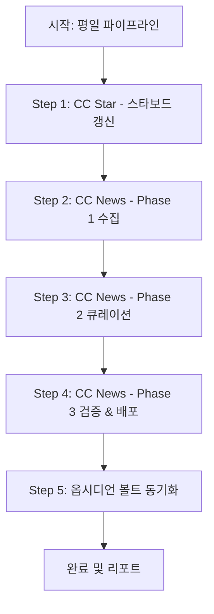

# CC Daily — 평일 AI Weekly 파이프라인

**목적:** 평일(월~금) 동안 매일 실행되는 정기 큐레이션 파이프라인으로, **스타보드 데이터 갱신(`cc-star`)**과 **데일리 24시간 AI 기술 신호 큐레이션(`cc-news`)**을 순차적으로 수행하고 옵시디언 볼트에 기록을 동기화한다.

---

## 실행 순서 및 세부 절차

### 1. Step 1: CC Star (스타보드 갱신)
- **명령어:** `node scripts/stars/collect-stars.js`
- **역할:** 주요 오픈소스 리포지토리의 최신 스타 수, 푸시 시점, 설명 메타데이터를 갱신한다.
- **결과 확인:** `data/stars/stars_meta.json`, `data/stars/stars_ledger.json`

### 2. Step 2: CC News (Phase 1 — 24시간 신호 수집)
- **명령어:** `node scripts/news/collect_news.js`
- **역할:** 7개 매체(GeekNews, Hacker News, AI타임스, Reddit, GitHub, Bluesky, HF Daily Papers)에서 최근 24시간의 기술 신호를 수집하여 `.tmp/news_candidates.json`에 저장한다.
- **점검:** 매체별 수집 건수, 누락(`[MISSING]`), 쿼리 에러(`[QUERY-FAIL]`) 확인.

### 3. Step 3: CC News (Phase 2 — 큐레이션)
- **규격 엄수:**
  - `title_ko`: 자연스러운 한국어 번역 (재등장 리포는 `[업데이트]` 접두사)
  - `summary_ko`: 완결된 문장의 한국어 3불릿
  - `body_ko`: 배경, 원리, 한계, 실사용 가치를 담은 **5~10문장** 엄수
  - `curated_by`: `"ldk-hub"` 고정
  - 최상위 `summary`: `🔥 오늘의 핵심 이슈: #[키워드1] #[키워드2] #[키워드3] — [인사이트 요약]. ldk-hub에서 큐레이션 하였습니다.`
  - 매체 균형: 각 매체당 3~5건 골고루 선별 (총 12~18건 이내)

### 4. Step 4: CC News (Phase 3 — 검증 및 배포 준비)
- **검증 게이트:** `node scripts/news/curate_news.js --validate` (통과 필수)
- **배포 리소스 갱신:**
  - `node scripts/core/generate-rss.js` (RSS 피드 갱신)
  - `node scripts/community/collect_lounge.js` (라운지 Discussions 스냅샷 갱신)

### 5. Step 5: 옵시디언 동기화
- **명령어:** `npm run sync:obsidian`
- **역할:** 로컬 옵시디언 볼트(`/Users/nhn/Documents/Obsidian Vault/ai-weekly`)에 큐레이션 히스토리 및 대시보드 동기화.

---

## 결과 보고 규격
파이프라인 완료 후 아래 항목을 요약 보고합니다:
1. **스타보드 갱신 요약:** 수집 대상 리포 수 및 주요 변동 사항
2. **뉴스 큐레이션 요약:**
   - 최종 큐레이션 건수 및 신호축(`model`, `product`, `devtool`, `oss`, `research`, `practice`, `policy`) 분포
   - 매체별 선별 건수 및 `[MISSING]` 매체 유무
   - 중복 차단 및 `[업데이트]` 건수
3. **배포 및 동기화 상태:** 검증 통과 여부 및 옵시디언 동기화 성공 여부
