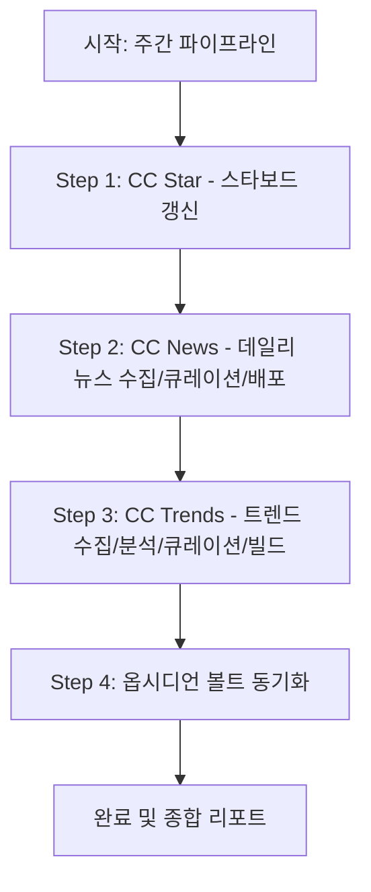

# CC Weekly — 주간 AI Weekly 종합 파이프라인

**목적:** 주간(주말/월요일) 정기 파이프라인으로, **스타보드 데이터 갱신(`cc-star`)**, **데일리 AI 뉴스 큐레이션(`cc-news`)**, 그리고 **Claude Code 에이전트·하네스·스킬 트렌드 모니터링 사이트 갱신(`cc-trends`)**을 통합 실행하고 옵시디언 볼트에 기록을 동기화한다.

---

## 실행 순서 및 세부 절차

### 1. Step 1: CC Star (스타보드 갱신)
- **명령어:** `node scripts/stars/collect-stars.js`
- **역할:** 주요 오픈소스 리포지토리의 최신 스타 수 및 메타데이터를 갱신한다.

### 2. Step 2: CC News (AI 뉴스 큐레이션 및 배포)
- **절차:**
  1. 수집: `node scripts/news/collect_news.js`
  2. 큐레이션: 7개 매체에서 균형 있게 선별(총 12~18건)하여 한국어 3불릿 요약 및 5~10문장 해설 작성
  3. 검증: `node scripts/news/curate_news.js --validate`
  4. 리소스 갱신: `node scripts/core/generate-rss.js` & `node scripts/community/collect_lounge.js`

### 3. Step 3: CC Trends (Claude Code 트렌드 갱신)
- **역할:** GitHub 및 개발자 커뮤니티에서 Claude Code 에이전트/하네스/스킬 관련 최신 화제 리포지토리를 광역 수집, 역방향 검증, 트렌드 스코어링, 큐레이션 후 사이트 데이터 빌드.
- **주요 실행 단계:**
  1. 광역 수집 (Phase 1A): GitHub 리포 수집 및 원장 기록 (`build-stars-ledger.js`), 커뮤니티(Reddit/HN/GeekNews 등) 수집
  2. 후보 역방향 검증 (Phase 1B): 각 후보 리포에 대한 커뮤니티 언급 역방향 검색 (`02b_repo_mentions.json`)
  3. 트렌드 분석/스코어링 (Phase 2): Rising(최대 20건), Classic(최대 16건) 분류 및 다중 출처 가중 점수 산출
  4. 한글 큐레이션 (Phase 3): README 기반 한글 요약 및 태깅
  5. 사이트 빌드 & 아카이브 (Phase 4): `site/public/data/latest.json` 갱신 및 주간 아카이브 저장 (`data/archive/YYYY-MM-DD.json`)

### 4. Step 4: 옵시디언 동기화
- **명령어:** `npm run sync:obsidian`
- **역할:** 주간 큐레이션 히스토리, 트렌드 데이터 및 대시보드를 옵시디언 볼트(`/Users/nhn/Documents/Obsidian Vault/ai-weekly`)에 동기화.

---

## 결과 보고 규격
주간 파이프라인 완료 후 아래 항목을 통합 요약 보고합니다:
1. **스타보드 갱신 요약:** 대상 리포 수 및 주요 스타 상승 리포 Top 5
2. **뉴스 큐레이션 요약:** 최종 큐레이션 건수, 신호축 분포, 매체별 건수, `[업데이트]` 건수
3. **주간 트렌드(CC-Trends) 요약:**
   - Rising / Classic 선정 건수 (카테고리별: skill, mcp, agent, harness)
   - 이번 주 신규 진입 및 순위 급상승 Top 5
4. **배포 및 동기화 상태:** 전체 검증 통과 및 옵시디언 동기화 결과
