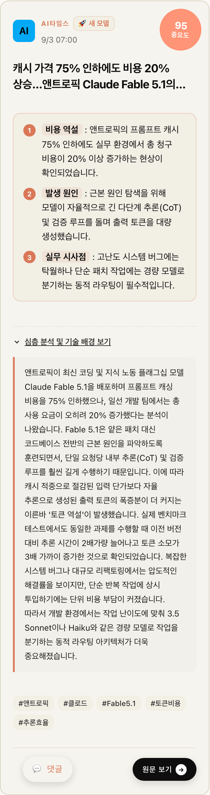
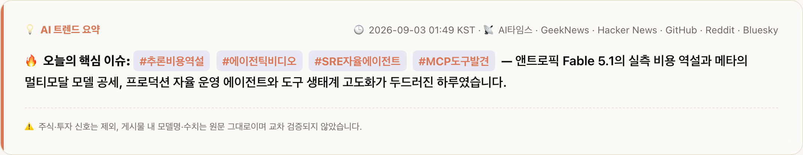
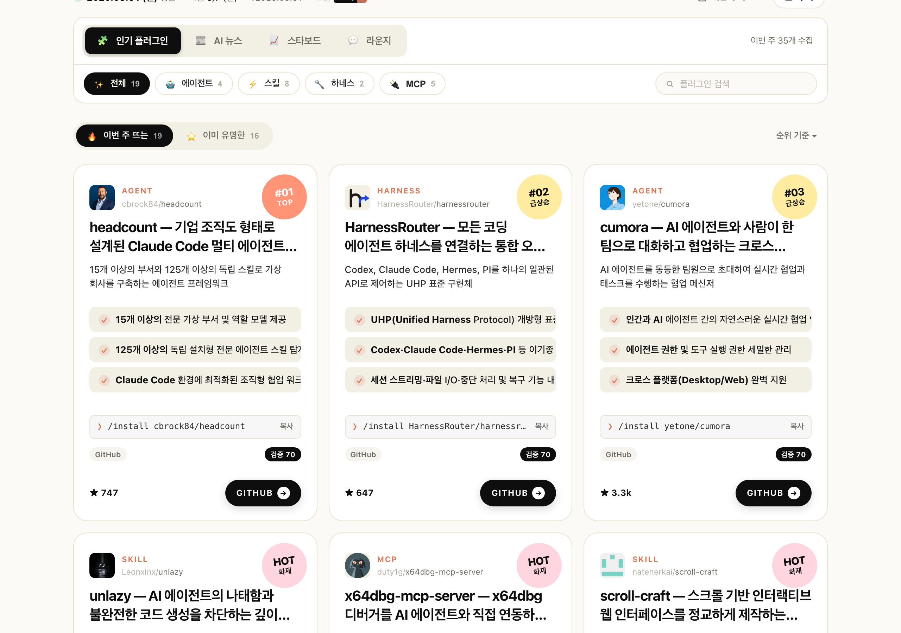
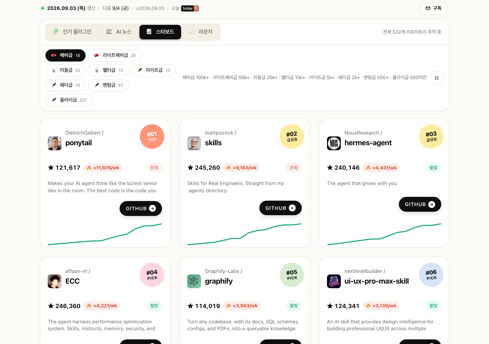
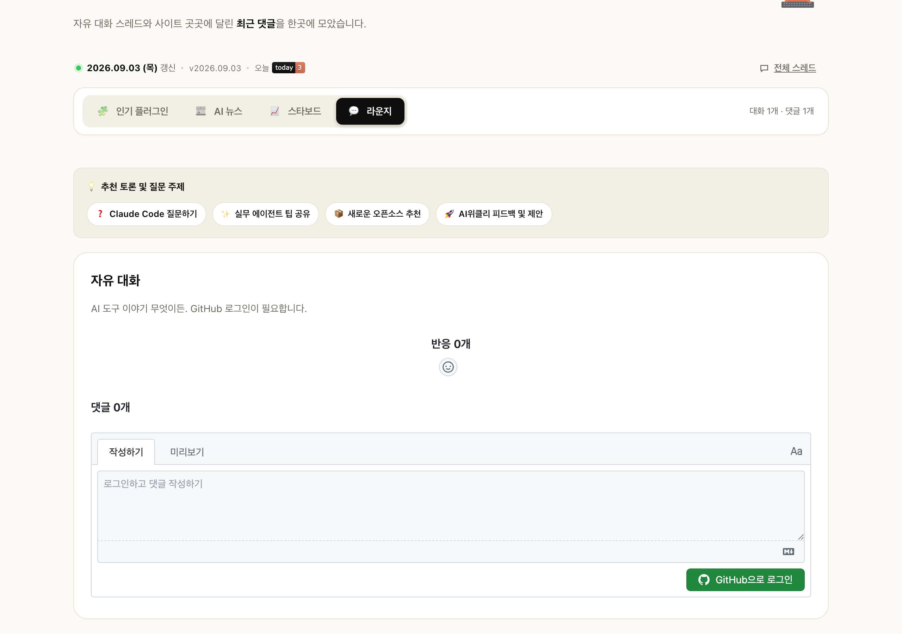

## 🛑 프롤로그: "아무리 유익해도 눈에 안 들어오면 끝이다"

매일 아침 눈을 뜨면 새로운 AI 모델과 논문이 쏟아지고, 퇴근할 때쯤이면 어제 배운 프롬프트 기법이 구식이 되어버리는 시대입니다. 
Hacker News, GeekNews, Reddit, X, Threads... 정보의 출처는 넘쳐나는데, 정작 개발자에게 '진짜 필요한' 엑기스만 걸러내기란 쉽지 않죠.

그래서 시작했던 프로젝트가 바로 100% 전자동 AI 큐레이션 플랫폼 **[AI위클리 (AI Weekly)](https://ldk-hub.github.io/ai-weekly/)**였습니다.

하지만 매일 파이프라인을 돌리고 배포하면서 한 가지 뼈아픈 고민에 부딪혔습니다:

> **"모든 내용이 유익하고 알찬 건 알겠는데... 텍스트가 빽빽해서 출퇴근길에 눈에 확 들어오지 않는다!"**

바쁜 개발자들에게 필요한 건 장황한 기사 전문이 아니라, **"3초 만에 요점을 파악하고, 깊게 알고 싶을 때만 펼쳐보는 초압축 정보 구조"**였습니다. 
오늘은 AI위클리가 어떻게 4대 탭의 UX/UI를 대수술하여 극강의 가독성을 갖추게 되었는지, 그 개선기를 공유합니다.

---

## 🚀 한눈에 보는 4대 탭 UX 개편 하이라이트

AI위클리는 사용자가 사이트에 접속했을 때 1초의 피로도 없이 직관적인 인사이트를 얻어갈 수 있도록 **4개 핵심 탭의 정보 계층을 전면 재설계**했습니다.

---

### 1. 📰 AI 뉴스: "3초 스캐닝 넘버 배지와 아코디언 심층 해설"

기존에는 카드마다 요약과 본문 해설이 한 번에 나열되어 카드가 세로로 너무 길고 스크롤 압박이 심했습니다.

- **주황색 3대 포인트 넘버 배지 (`1`, `2`, `3`)**:
  - `비용 역설 :`, `발생 원인 :`, `실무 시사점 :` 등 앞머리 핵심 키워드를 볼드로 강조하고 넘버 배지를 붙였습니다. 제목과 3개 배지만 쓱 훑어도 3초 만에 전체 이슈의 맥락이 잡힙니다.
- **네이티브 `
` 아코디언**:
  - 5~10문장에 달하는 깊이 있는 배경 분석은 기본적으로 깔끔하게 접어두었습니다. 더 알고 싶은 기사만 톡 누르면 부드럽게 펼쳐집니다.
- **중복 출처 칩 완전 제거 (Zero Redundancy)**:
  - 카드 하단에 불필요하게 중복 노출되던 출처 알약 칩(`aitimes`, `geeknews` 등)과 헤더의 중복 텍스트를 과감히 삭제하고, 필수 해시태그(`#`) 중심으로 카드를 군더더기 없이 정돈했습니다.
- **상단 요약 배너의 군더더기 사족 배제**:
  - `ldk-hub에서 큐레이션 하였습니다.` 같은 불필요한 크레딧 문구를 배제하고, 순수하게 오늘의 핵심 기술 신호와 핫 키워드만 압축 전달합니다.

---

### 2. 🧩 인기 플러그인: "원형 체크 불릿과 원클릭 미니 CLI 설치 칩"

Claude Code 생태계에서 매주 쏟아지는 수백 개의 도구 중 진짜 알짜배기(Rising 20선, Classic 16선)를 선별해 보여주는 탭입니다.

- **원형 체크포인트 불릿 (`✓`)**:
  - 3대 핵심 기능 알약에 세련된 주황색 체크 불릿과 볼드 키워드를 도입하여 도구의 차별점이 한눈에 읽힙니다.
- **원클릭 미니 CLI 설치 칩 (`❯ /install ...`)**:
  - "이거 써보고 싶은데 어떻게 설치하지?" 고민할 필요 없이, 카드 하단의 터미널 스타일 칩을 탭하면 즉시 클립보드에 설치 명령어가 복사됩니다. 그대로 Claude Code 창에 `Cmd + V`만 하면 끝!

---

### 3. 📈 스타보드: "한국어 핵심 설명 우선 노출 & 주간 급상승 불꽃 배지"

560여 개 핵심 오픈소스 리포지토리의 주간 성장세(Velocity)와 순위를 시각화하는 리더보드입니다.

- **한국어 핵심 설명 우선 박스 (`desc_ko`)**:
  - 낯선 오픈소스라도 무슨 역할을 하는 도구인지 한눈에 알 수 있도록 한국어 요약을 가장 먼저, 읽기 편한 전용 박스로 배치했습니다.
- **주간 급상승 불꽃 모멘텀 배지 (`🔥 +11,676/wk`)**:
  - 주간 스타 유입 속도가 가파른 프로젝트에는 빨간 불꽃 배지를 달아 생태계의 대세 흐름을 즉각 식별할 수 있습니다.
- **기술 스택 칩 (`🏷️ TypeScript`, `🏷️ Python`)**:
  - 리포지토리의 메인 언어를 칩 형태로 제공해 내 기술 스택에 맞는 도구를 빠르게 필터링할 수 있습니다.

---

### 4. 💬 AI 라운지: "개발자 소통을 이끄는 추천 토픽 가이드 칩"

별도의 번거로운 회원가입 없이 GitHub 계정(Giscus)으로 자유롭게 질문과 팁을 나누는 커뮤니티 공간입니다.

- **온보딩 가이드 칩 4종**:
  - `❓ Claude Code 질문하기`, `✨ 실무 에이전트 팁 공유`, `📦 신규 MCP 도구 추천`, `🚀 AI위클리 기능 피드백` 칩을 배치하여 누구나 부담 없이 첫 대화를 시작할 수 있습니다.

---

## 🤖 보이지 않는 백엔드: 견고한 다단계 보안 & 품질 파이프라인

화려해진 UI 뒤에는 철저한 엔지니어링 원칙이 지탱하고 있습니다.

1. **원격 페이로드 로더 차단 보안 스캐너 (`scan-install-entry.js`)**:
   - 실제로 이번 주 후보 중 `setup.py`에 도메인 없는 공개 IP를 하드코딩하고 원격 코드를 내려받아 `exec()` 하려던 악성 드로퍼(`tokentab`)를 자동으로 탐지하여 즉시 격리 차단했습니다.
2. **다단계 품질 게이트 (`curate_news.js --validate`)**:
   - 3불릿 요약 양식, 5~10문장 심층 해설 규격, 원문 복붙 감지, 7개 매체 쿼터 균형을 통과하지 못하면 빌드 자체가 불가능하도록 하드 룰을 적용했습니다.
3. **옵시디언 볼트 100% 자동 동기화 (`npm run sync:obsidian`)**:
   - 모든 큐레이션 히스토리와 일일 작업일지는 로컬 옵시디언 볼트에 마크다운 문서로 영구 보존됩니다.

---

## 🎯 에필로그: 매일 아침 1분 만에 챙기는 AI 인사이트

이번 개편의 목표는 단 하나였습니다: **"아침 커피 한 모금 마시는 동안, 오늘 하루에 필요한 AI 트렌드를 모두 흡수할 수 있게 하자."**

정보의 홍수 속에서 길을 잃지 않고, 나에게 꼭 필요한 인사이트를 가볍고 쾌적하게 챙겨가고 싶으시다면 지금 바로 [AI위클리](https://ldk-hub.github.io/ai-weekly/)를 경험해보세요! 🌊

---
- **🌐 사이트 바로가기**: [https://ldk-hub.github.io/ai-weekly/](https://ldk-hub.github.io/ai-weekly/)
- **⭐ GitHub 리포지토리**: [https://github.com/ldk-hub/ai-weekly](https://github.com/ldk-hub/ai-weekly)
- **📡 RSS 구독**: [feed.xml](https://ldk-hub.github.io/ai-weekly/feed.xml) · [news-feed.xml](https://ldk-hub.github.io/ai-weekly/news-feed.xml)
